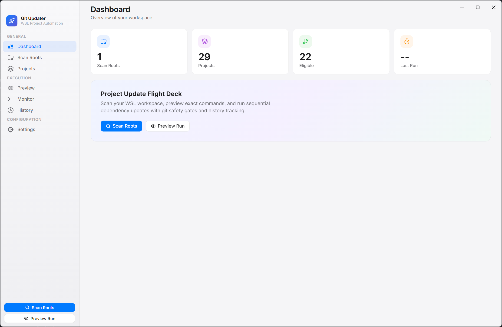

# Git Project Updater

[](https://github.com/dbfx/git-projects-updater/actions/workflows/release.yml)
[](LICENSE)
[](https://github.com/dbfx/git-projects-updater/releases/latest)

[](https://github.com/dbfx/git-projects-updater/releases/latest)

Electron desktop app for Windows that scans WSL project roots, detects update-capable repositories, previews actions, and executes dependency + git automation with safety gates.

## Screenshot



## Features

- **Multiple WSL roots** — Save multiple project root paths with configurable scan depth (1–3) and exact exclusions
- **Automatic project discovery** — Detects projects by manifest files:
  - `composer.json` (PHP / Composer)
  - `package.json` with an exclusive `pnpm-lock.yaml` (npm, Yarn, Bun, and mixed lockfiles are refused)
  - `requirements.in` / `requirements.txt` (Python / pip)
- **Git eligibility checks** — Only updates repositories on `main` / `master` with a clean working tree
- **Preview-first workflow** — See exactly what will happen before confirming execution
- **Lockfile-only pnpm updates** — Updates manifests and `pnpm-lock.yaml` without writing `node_modules` or running lifecycle scripts
- **Sequential execution** — Runs updates one project at a time with retry logic and push conflict recovery (rebase + retry)
- **Live run logs** — Watch progress in real time with persisted run history (last 50 runs)
- **Windows packaging** — NSIS installer and portable .exe

## Download

Download the latest release from the [Releases page](https://github.com/dbfx/git-projects-updater/releases/latest):

- **Git Project Updater Setup x.y.z.exe** — Windows installer (recommended)
- **Git Project Updater x.y.z.exe** — Portable executable (no installation required)

## Development

### Prerequisites

- Node.js 20+
- npm
- WSL with a Linux distro installed

### Setup

```bash
git clone https://github.com/dbfx/git-projects-updater.git
cd git-projects-updater
npm install
npm run dev
```

### Scripts

| Command | Description |
|---------|-------------|
| `npm run dev` | Start in development mode (Vite + Electron) |
| `npm run build` | Build renderer and main process |
| `npm run dist` | Build and package with electron-builder |
| `npm run test` | Run tests with Vitest |
| `npm run typecheck` | TypeScript type checking |
| `npm run release` | Bump version, update changelog, tag and push |

### Building

```bash
npm run dist
```

Output is written to the `release/` directory.

## Configuration

1. Open the app and go to **Settings**
2. Select your WSL distro
3. Add one or more project root paths (WSL-style, e.g. `/home/user/projects`)
4. Ensure required tools are installed inside the WSL distro:
   - `git`
   - `composer` (for PHP projects)
   - `node` and `pnpm` on the non-interactive WSL `PATH` (the app does not activate nvm/fnm)
   - `python` / `pip` (for Python projects)
   - `pip-compile` (optional, for `requirements.in`)

## Contributing

1. Fork the repository
2. Create a feature branch (`git checkout -b feat/my-feature`)
3. Write your changes using [conventional commits](https://www.conventionalcommits.org/) (e.g. `feat:`, `fix:`, `docs:`)
4. Run `npm run typecheck && npm run test` to verify
5. Open a pull request

## License

This project is licensed under the MIT License — see the [LICENSE](LICENSE) file for details.
